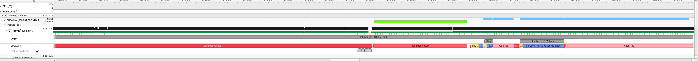

# RAW processing on CUDA

This application unpack RAW data with LibRaw and copies it to GPU to run **debayering** and apply effects like contrast and exposure correction on GPU and preview results without copying data back to host. Applying filters and effects on GPU is more efficient, especially with GL interop to copy data to texture for preview, meaning that UI sliders modify image in real-time with minimal latency.

Debayering is handeled with NVIDIA Performance Primitives.

This app allows exporting RAW images to JPEG with nvJPEG library. TIFF on CPU is implemented as fallback.

## Dependencies & Build

* CUDA Toolkit (CUDA, nvJPEG, NPP, NVTX)
* GLFW3
* GLAD (included)
* LibRaw
* LibTiff

### How to build

Run ```./compile``` after installing required dependencies. You will get ```cudaraw``` binary. Run it with RAW image (NEF, CR3, DNG etc) as an argument.

## Screenshots

I found great RAW samples on [DPREVIEW](dpreview.com). Used footage is linked under each screenshot and I do not claim rights for any images.


<video autoplay loop muted playsinline src="video.webm"></video>

[Phase One IQ4 sample image](https://www.dpreview.com/sample-galleries/5619674350/phase-one-iq4-sample-gallery/4227897306)

## Performance

On my RTX5060 mobile, NPP debayer kernel for the image above took around 2ms, which is way faster than on CPU processing. Whole startup pipeline takes around 600-800ms (excluding GLFW init), where 350-400ms is LibRaw loading and unpacking RAW data and 350-400ms is total CUDA work including memory allocation and context initialization.

Effects kernel takes around 10ms for image this big. I tested on 24.2MP image from my own camera and effects kernel took around 2ms.

Below is attached Nsight Systems timeline of ```debayer_init``` block. First ```cudaMallocPitch``` takes some time to initialize context, next calls are nearly instant.

